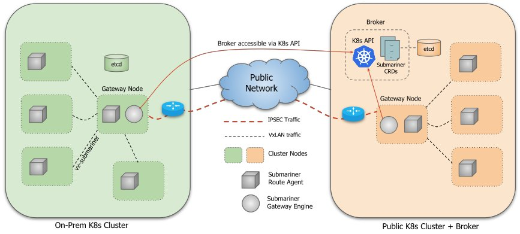

## Daisy

> Smoothen local development with Kubernetes.

### [Table of content](#table-of-content)
- [Table of content](#table-of-content)
- [Introduction](#introduction)
  * [Docker Compose](#docker-compose)
  * [Local Kubernetes Clusters](#local-kubernetes-clusters)
- [Meet Daisy](#meet-daisy)
  * [Requirements](#requirements)
  * [Goals](#goals)
  * [Concept](#concept)
  * [Submariner](#submariner)
  * [Setup Submariner](#setup-submariner)
  * [Access resources across clusters](#access-resources-across-clusters)
  * [Normalize the hosts](#normalize-the-hosts)
  * [Migrate your infrastructure](#migrate-your-infrastructure)

### [Introduction](#introduction)

Running a single service locally is most of the time pretty straightforward. But when it comes to microservices architecture, developing locally might become a real mess. There are obviously already existing solutions or patterns that might help you dealing with running highly coupled services on your local machine, all of them with their weaknesses and strengths.

One can think about docker-compose which helps a lot to start an entire stack in the blink of an eye, and in a deterministic way. Others will better bet on linking remote deployments with local ones to save resources and make the inner loop more efficient. What about getting the best of both worlds ?

#### [Docker Compose](#docker-compose)

Running a stack of multiple services with `docker-compose.yaml` requires a certain amount of boilerplate and information about your services. First, one needs to write a `docker-compose.yaml` file, made of one or multiple `services` that need to be kept up to date with your current code. Moreover, if all of your services do not belong to the same repository, you got two options here:

##### Declare a root `docker-compose.yaml` in a dedicated repository

In this case, you can create a master `docker-compose.yaml` referencing all your services. For each of those services, you'll have to set the path to your local clone for each repository. Also, if you start the whole stack, resources requirements might quickly become overwhelming. If not, `docker-compose` will automatically starts the services' dependencies you need thanks to the `depends_on` clause. However, sometimes you just don't want to run the service's dependencies locally and better use remote deployments shared across all your team. To do so, you'll have to manually edit your `docker-compose.yaml` and update the URLs in the environment or arguments.

If you're lucky enough, someone built a CLI or an UI for that in your company, which needs to be constantly updated for no business win at all.

- Pros:
  * Easy to read
  * Handles cross services dependencies
  * Highly extensible
- Cons:
  * Hard to setup
  * Requires a lot of resources
  * Not very flexible
  * A mess to maintain, as the repository will have to be maintained by all the teams
  * Need to maintain both the `docker-compose` services' declaration and the deployments of the services

##### Declare a `docker-compose.yaml` in each repository

If you go for the most canonical way of working with `docker-compose`, each repository will define a `docker-compose`.yaml at the root scope. When describing your services, you can definitely, by default, reference remote hosts for dependencies that do not belong to the same repository. However, as soon as you start another service from another repository and want to test both work properly, you'll have to manually edit your two `docker-compose.yaml` files to reference local hosts.

- Pros:
  * Easy to setup and read
  * Easy to maintain as each team is in charge of its own services in their very own repositories
- Cons:
  * Not very flexible
  * Does not really handle cross services dependencies
  * Need to maintain both the `docker-compose` services' declaration and the deployments of the services

#### [Local Kubernetes clusters (e.g `minikube`, `kind`, `k3s`...)](#local-kubernetes-clusters)

The exact same rules apply to running your stack locally on top of a `Kubernetes` cluster. Getting a cluster up and running on your local machine became more and more easy over the past years thanks to amazing tools such as `minikube`, `kind`, `k3s` and many others I can't think of. 

Still there is one major improvement that makes a huge difference: your manifests are shared between all your environments, be them production, staging or local. You do not need to maintain both your `Kubernetes` and your `docker-compose` manifests, but can use the same primitives everywhere which reduces by far your toil overhead.

Same as running `docker-compose`, we got two cases here:

##### Centralize your stack definition

One can create a new repository to store a global stack definition. For instance, each repository could define a `Helm` chart that would then be pushed to a `Chartmuseum` or any other registry, and declared as a dependency of your stack. Please note that, still, pointing to your local stack or the remote one is pretty tricky and would require some manual or user-driven automatised intervention.

- Pros:
  * Same primitives across all your environments
  * Easy to setup
  * Handles cross services dependencies
  * Highly extensible
- Cons:
  * Requires some `Kubernetes` knowledge
  * Hard to setup
  * Requires a lot of resources
  * Not very flexible
  * A mess to maintain, as the repository will have to be maintained by all the teams

##### Leave your `Kubernetes` manifests where they belong to

Running `kubectl apply -f`, `kubectl apply -k` or `helm install` depending on the tools you like will be enough for running your services. However, referencing remote or local services won't be easier as hosts will need to be manually updated.

- Pros:
  * Same primitives across all your environments
  * Easy to maintain as each team is in charge of its own services in their very own repositories
- Cons:
  * Requires some `Kubernetes` knowledge
  * Not very flexible
  * Does not really handle cross services dependencies
  * Need to maintain both the docker-compose services' declaration and the deployments of the services

### [Meet Daisy](#meet-daisy)

`Daisy` is not a tool. It is more of a pattern, from which you can build a suprisingly efficient inner loop in a very simple way.

#### [Requirements](#requirements)

* Your stack is running on `Kubernetes`
* Each feature team owns its own repositories
* Each repository contains the manifests of the services it contains
* Each team should be able to maintain those manifests
* Naming and namespacing of your `Kubernetes` resources are isomorphic across your different environments

#### [Goals](#goals)

* Each team should be in charge of its repositories, with no external dependencies
* When an user wants to start a service, it does not need to be aware of the service's dependencies
* When an user starts multiple services locally, they should communicate with each other without human intervention
* When an user starts a service, it should transparently communicate with remote dependencies unless one or multiple of these dependencies are actually running locally

#### [Concept](#concept)

Let's say you got a stack made of 10 services. Each service lives in its own repository. You deploy those services on top of `Kubernetes` on `production` stage. You also have a `staging` (or whatever you call it) cluster which is being used for product testing or any other purpose. This environment can be considered as stable.

Now you want to run `service-a` locally. Your manifests leverage `Kustomize` capabilities so you end up with a manifests' folder structure similar to the following:

```
+-- bases
|   +-- deployment.yaml
|   +-- svc.yaml
|   +-- pdb.yaml
|   +-- hpa.yaml
|   +-- kustomization.yaml
+-- local
|   +-- custom-deployment.yaml
|   +-- kustomization.yaml
+-- staginng
|   +-- custom-deployment.yaml
|   +-- custom-pdb.yaml
|   +-- custom-hpa.yaml
|   +-- kustomization.yaml
+-- production
    +-- custom-deployment.yaml
    +-- custom-pdb.yaml
    +-- custom-hpa.yaml
    +-- kustomization.yaml
```

With `Helm`, you should end up with something like this:

```
+-- charts
+-- templates
|   +-- deployment.yaml
|   +-- svc.yaml
|   +-- pdb.yaml
|   +-- hpa.yaml
+-- values.yaml
+-- values-local.yaml
+-- values-staging.yaml
+-- values-production.yaml
+-- Chart.yaml
```

Now a simple `kubectl apply -k local` or `helm install service-a . -f values-local.yaml` should deploy your service. However your service `service-a` has a strong dependency with `service-b`. You don't know how `service-b` works because you're not part of the team that own the repository. Therefore in your local/custom-deployment.yaml file, you referenced a remote host:

```yaml
apiVersion: apps/v1
kind: Deployment
metadata:
  name: service-a
spec:
  template:
    spec:
      containers:
      - name: service-a
        args:
        - --service-b-url
        - service-b.example.com
```

Everything should be working properly in this case. Now let's say you clone `service-b`'s repository and start it locally. You update the code and would like to test the interaction between `service-a` and `service-b`. What you need to do is editing the manifest in such a way:

```yaml
apiVersion: apps/v1
kind: Deployment
metadata:
  name: service-a
spec:
  template:
    spec:
      containers:
      - name: service-a
        args:
        - --service-b-url
        - service-b.namespace-b
```

And apply it again. This is not very smooth right ? What if you it could happen automatically ?

The first thoughts could be: why don't I ask to the user which service(s) they want locally or in remote and we can dynamically template the values ? According to my small experience, this pattern works well when dealing with 5-10 services, not when running tens of them.

This is where `Daisy` is different. Let's think about it:

* What is the FQDN of `service-b` when running locally ? `service-b.namespace-b.svc.cluster.local`
* What is the FQDN of `service-b` when running remotely ? `service-b.namespace-b.svc.<cluster-domain-name>`

They look pretty similar right ? What if both the clusters could share their DNSs and networks, and the local one could fallback to the remote cluster in case the local DNS entry does not exist ?

#### [Submariner](#submariner)

[Submariner](https://submariner.io/) is a tool developed by [Rancher](https://rancher.com/) which enables networking between pods and services that are running in different clusters. It includes a lot of interesting features such as out of the box service discovery.

In practice, `Submariner` needs a `Broker` to be part of a publicly accessible cluster. It will be the single source of truth for configuration of your topology. Also `Submariner` allows one or many clients to be part of the topology.

Each client needs to join the `Broker` where they will fetch the other clients' configuration from. An IPSec tunnel gets then created between each client in a Host-to-Host topology. Submariner relies on `StrongSwan` for the Host-to-Host IPSec VPN.

`Submariner` performs two distinct actions:
* Extend `CoreDNS` capabilities with a `Lighthouse` plugin which allows to resolve the `supercluster.local` domain
* Handle the traffic that maps to one of the clients' CIDRs

Basically what happens is:
* You create a publicly reachable `Kubernetes` cluster you deploy the `Broker` onto
* You also join the `Broker` as a client with the same cluster
* You create a local `Kubernetes` cluster with kind and also join the `Broker` as a client
* Now, every service that you will expose with `Submariner` will be accessible by both the clusters, wherever it's running, at `servicename.namespace.svc.supercluster.local`

Please find below a more detailed diagram of `Submariner`'s architecture.



#### [Setup Submariner](#setup-submariner)

First, you'll need to install `subctl` and `kind`:

```sh
$ brew install kind
$ wget https://github.com/submariner-io/submariner-operator/releases/download/v0.5.0/subctl-v0.5.0-darwin-amd64.tar.xz
$ tar -xvf subctl-v0.5.0-darwin-amd64.tar.xz
$ mv subctl/subctl-v0.5.0-darwin-amd64 /usr/local/bin/subctl
```

> The aforementioned commands work for OSX only. If running another OS, please refer to the official documentation for [subctl](https://submariner.io/quickstart/kind/) and [kind](https://kind.sigs.k8s.io/docs/user/quick-start/).

Let's get things up and running. You'll see, it will be pretty straightforward. Let's assume that we have:
* `cluster-0` which is publicly accessible (e.g your staging cluster)
* `cluster-1` which is your locally running cluster

To create you local cluster, use the following command:

```sh
$ cat <<EOF > config.yaml
kind: Cluster
apiVersion: kind.x-k8s.io/v1alpha4
networking:
  podSubnet: "10.42.0.0/16"
  serviceSubnet: "10.43.0.0/16"
nodes:
  - role: control-plane
  - role: worker
EOF

$ kind create cluster --name cluster-1 --config config.yaml
```

You can edit the `podSubnet` and `serviceSubnet` fields but you need to create both a `control-plane` and a `worker` node. `Submariner` looks for a `worker` node to label and deploy the `Gateway` which is in charge of creating the IPSec tunnel between clients.

Then you can deploy the `Broker` into `cluster-0`:

```sh
$ subctl deploy-broker \
    --service-discovery \
    --kubeconfig client-0-kubeconfig.yml
```

Wait for the deployment to complete. When it's done, you should see a newly created `broker-info.subm` file which will be required for any other client to join.

Then create a new client from `cluster-0`:

```sh
$ subctl join \
    broker-info.subm \
    --clusterid client-0 \
    --kubeconfig submariner-broker-kubeconfig.yml
```

Please note that, in some cases, Submariner does not manage to resolve the service and pod CIDRs on it own. In this case, you can define them explicitly:

```sh
$ subctl join \
    broker-info.subm \
    --clusterid client-0 \
    --servicecidr <servicecidr> \
    --clustercidr <clustercidr> \
    --kubeconfig submariner-broker-kubeconfig.yml
```

Now you can create another client from your local cluster `cluster-1`:

```sh
$ subctl join \
    broker-info.subm \
    --kubeconfig client-1-kubeconfig.yaml \
    --clusterid client-1
```

To make sure everything went well, you can run:

```sh
$ kubectl --kubeconfig client-1-kubeconfig.yaml -n submariner-operator describe gateways.submariner.io
Name:         pool-mthnl4t75-3gfdp
Namespace:    submariner-operator
Labels:       <none>
Annotations:  update-timestamp: 1597845306
API Version:  submariner.io/v1
Kind:         Gateway
Metadata:
  Creation Timestamp:  2020-08-19T08:12:17Z
  Generation:          4064
  Managed Fields:
    API Version:  submariner.io/v1
    Fields Type:  FieldsV1
    fieldsV1:
      f:metadata:
        f:annotations:
          .:
          f:update-timestamp:
      f:status:
        .:
        f:connections:
        f:haStatus:
        f:localEndpoint:
          .:
          f:backend:
          f:cable_name:
          f:cluster_id:
          f:hostname:
          f:nat_enabled:
          f:private_ip:
          f:public_ip:
          f:subnets:
        f:statusFailure:
        f:version:
    Manager:         submariner-engine
    Operation:       Update
    Time:            2020-08-19T13:55:06Z
  Resource Version:  41252
  Self Link:         /apis/submariner.io/v1/namespaces/submariner-operator/gateways/pool-mthnl4t75-3gfdp
  UID:               434dd0fe-e1d8-49be-9590-64a4b8101ed8
Status:
  Connections:
    Endpoint:
      Backend:      strongswan
      cable_name:   submariner-cable-client-1-172-19-0-2
      cluster_id:   client-1
      Hostname:     client-1-worker
      nat_enabled:  true
      private_ip:   172.19.0.2
      public_ip:    89.3.199.26
      Subnets:
        10.1.0.0/16
        10.0.0.0/16
    Status:          connected
    Status Message:  Connected to 89.3.199.26:64586 - encryption alg=AES_GCM_16, keysize=128 rekey-time=7072
  Ha Status:         active
  Local Endpoint:
    Backend:      strongswan
    cable_name:   submariner-cable-client-0-165-232-48-78
    cluster_id:   client-0
    Hostname:     pool-mthnl4t75-3gfdp
    nat_enabled:  true
    private_ip:   165.232.48.78
    public_ip:    165.232.48.78
    Subnets:
      10.245.0.0/16
      10.120.0.0/16
  Status Failure:  
  Version:         v0.5.0
Events:            <none>
```

The output should look like this.

#### [Access resources across clusters](#access-resources-across-clusters)

Now that `Submariner` has been properly setup, we can deploy resources on top of our clusters to see how they work out.

In our cluster `cluster-0`, we are going to create a new `Deployment` `nginx` in namespace `nginx` and expose it with a `Service`. Then, we're going to expose it to all connected clients with `subctl`.

```sh
$ export KUBECONFIG=$(pwd)/cluster-0-kubeconfig.yml
$ kubectl create ns nginx
$ kubens nginx
$ kubectl create deployment nginx --image=nginx
$ kubectl expose deployment nginx --port 80
$ subctl export service nginx
```

Now, from your local cluster `cluster-1`, you should be able to see the newly exported service that was synced from the Broker:

```sh
$ kubectl --kubeconfig $(pwd)/cluster-1-kubeconfig.yml get serviceimports.lighthouse.submariner.io --all-namespaces
NAMESPACE             NAME                   AGE
submariner-operator   nginx-nginx-client-0   5h50m
```

Now if you create a random pod and `curl` the url `nginx.nginx.svc.supercluster.local`, you should be able to reach your remote Service:

```sh
$ kubectl run --image ubuntu -i --tty --rm -- bash
root@bash:/# apt update && apt install -y curl
root@bash:/# curl nginx.nginx.svc.supercluster.local
<!DOCTYPE html>
<html>
<head>
<title>Welcome to nginx!</title>
<style>
    body {
        width: 35em;
        margin: 0 auto;
        font-family: Tahoma, Verdana, Arial, sans-serif;
    }
</style>
</head>
<body>
<h1>Welcome to nginx!</h1>
<p>If you see this page, the nginx web server is successfully installed and
working. Further configuration is required.</p>

<p>For online documentation and support please refer to
<a href="http://nginx.org/">nginx.org</a>.<br/>
Commercial support is available at
<a href="http://nginx.com/">nginx.com</a>.</p>

<p><em>Thank you for using nginx.</em></p>
</body>
</html>
```

#### [Normalize the hosts](#normalize-the-hosts)

Now that everything works well, we're still not done yet. What we want is being able to curl `nginx.nginx.svc`, resolve it to our local deployment if available, and fallback to the remote one otherwise.

If you still have you ubuntu pod running, run the following command:

```sh
root@bash:/# cat /etc/resolv.conf
search nginx.svc.cluster.local svc.cluster.local cluster.local
nameserver 10.1.0.10
options ndots:5
```

Here operates the magic. We won't go too deep into `Kubernetes` and the way it handles DNSs resolution but the reason why you can `curl http://nginx` within the same namespace as a `Service` called `nginx` without specifying a FQDN is the search line of the output. When you ask for nginx, it'll look sequentially for `nginx.nginx.svc.cluster.local`, `nginx.svc.cluster.local` and `nginx.cluster.local`. Now, what happens if we tell it to eventually fallback to `supercluster.local` ?

Let's kill our pod and create a new one with a custom DNS config:

```sh
$ cat <<EOF > pod.yaml
apiVersion: v1
kind: Pod
metadata:
  name: ubuntu
spec:
  containers:
  - name: ubuntu
    image: ubuntu
    command:
    - tail
    - -f
    - /dev/null
  dnsConfig:
    searches:
    - supercluster.local
EOF

$ kubectl apply -f pod.yaml
```

Now, run `kubectl exec -it ubuntu bash` to exec into the pod and run:

```sh
$ getent hosts nginx.nginx.svc
10.245.214.98   nginx.nginx.svc.supercluster.local
```

To see what happens if you create a `Deployment` and `Service` with the same name locally, run:

```sh
$ export KUBECONFIG=$(pwd)/cluster-1-kubeconfig.yml
$ kubectl create ns nginx
$ kubens nginx
$ kubectl create deployment nginx --image=nginx
$ kubectl expose deployment nginx --port 80
```

If you now rerun your command, you'll get a different output:

```sh
root@ubuntu:/# getent hosts nginx.nginx.svc
10.1.184.216    nginx.nginx.svc.cluster.local
```

#### [Migrate your infrastructure](#migrate-your-infrastructure)

Migration is pretty smooth. All you need is deploying the `Broker` into your development `Kubernetes` cluster, create a client inside of the same cluster. Then from any locally running cluster, join the `Broker` the same way. Also, all your local `Deployments` should have the following custom dns configuration:

```yaml
  dnsConfig:
    searches:
    - supercluster.local
```

Then, you should expose all the `Services` you want to be available locally either with `subctl`, or by creating a `ServiceExport` resource for each of them:

```yaml
apiVersion: lighthouse.submariner.io/v2alpha1
kind: ServiceExport
metadata:
  name: <servicename>
  namespace: <servicenamespace>
```

However please note that:
* Services should **always** be reached with url of form `<servicename>.<namespace>.svc`
* DNS lookup in general might be slower (to be investigated)
* Local clusters should **all** have a different `podCIDR` and `serviceCIDR` when adding more clients
